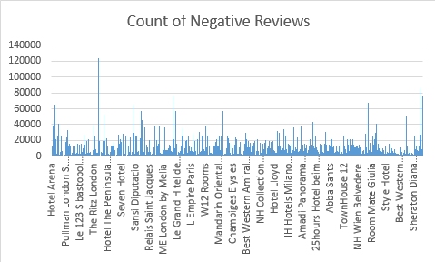
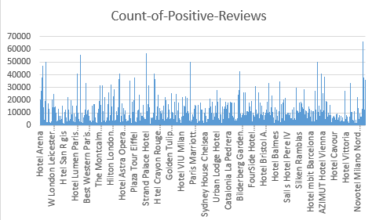
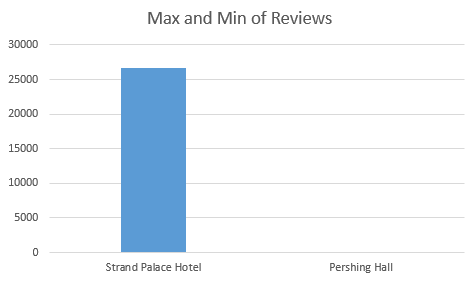

# map-reduce-fab-four
This repo is created to do a map-reduce group project on a simple data set. The goal is to create a  sample project that introduces our project to a developer not familiar with HDFS or MapReduce.

# Background
In Hadoop the two core concepts we use are: 
1. HDFS : Hadoop distributed file system is to store the information.
2. Map-Reduce : This is used to process the information.

In this project we are going to apply the map-reduce concept by writing the python programs for mapper and reducer. Please follow the step-by-step instructions provided below to get familiarized with the project.

# Project : Group 5
## Course: BIG DATA SP20
## Developers
1. Vijay Kumar Karanam
2. Harsha Vardhan Reddy Nallavolu
3. Lavanya Reddy Uppula
4. Prajakt Uttamrao Khawase

## Links
- [Source_Repo](https://github.com/KaranamVijayKumar/map-reduce-fab-four)
- [Website](https://karanamvijaykumar.github.io/map-reduce-fab-four/)
- [Issue_Tracker](https://github.com/KaranamVijayKumar/map-reduce-fab-four/issues)
- [Data_Source](https://www.kaggle.com/jiashenliu/515k-hotel-reviews-data-in-europe)

## Introduction
The data was scraped from Booking.com. All data in the file is publicly available to everyone already. Data is originally owned by Booking.com. This dataset contains 515,000 customer reviews and scoring of 1493 luxury hotels across Europe. Meanwhile, the geographical location of hotels are also provided for further analysis.

## V's of the data

The key attributes of the data set are Hotel_Name, Review_Total_Negative_Word_Counts, Total_Number_of_Reviews, and Review_Total_Positive_Word_Counts.

- V's for the new Identified Data set: -

1. Volume: - The Volume of the data is 227 MB and it contains 17 fields.

2. Variety: - The data is structured in CSV format and it is clean.

3. Velocity: - Currently the velocity of the data set is zero as all the data is historical data and no incoming data will come to the data set.

4. Veracity: - The data is clean and contains 515,000 customer reviews and scoring of 1493 luxury hotels across Europe.

5. Value: - We can cluster the hotels based on the reviews and perform sentimental analysis on the reviews.

## Big Data Problems addressed in this project

Below are the problem statements that each developer worked on: 

1. Harsha Vardhan Reddy Nallavolu
 - For each Hotel, find the count of positive_word_reviews.
2. Prajakt Uttamrao Khawase
 - For each Hotel, find the count of negative_word_reviews.
3. Vijay Kumar Karanam 
 - For each Hotel, find the maximum of total number of reviews reviewer has given.
4. Lavanya Reddy Uppula
 - For each Hotel, find the minimum of total number of reviews reviewer has given.

## Instructions to run the Project
## Requirements
- Install Chocolatey, the Windows package manager.
- Install Python 3.
- Install Git for Windows.
- Install TortoiseGit.
- Add Open Command Window Here as Administrator to your File Explorer context menu.
- Install Visual Studio Code for text editing.

## How to run

- Each developer has created their own folder which addresses their unique problem statement. Inside that folder you can find two files mapper.py and reducer.py.
- First you need to execute mapper.py and then reducer.py.
- To execute both files you need to open powershell as administrator and use the syntax "python filename".
- For example to execute mapper, you will type : python mapper.py
- The output will be generated in the same folder within a text file after the reducer is executed.

## Final Results

1. Count of Total Negative Reviews

2. Count of Total Positive Reviews

3. Max and Min of Total Reviews

## Citations

The data was scraped from Booking.com. All data in the file is publicly available to everyone already. Data is originally owned by Booking.com. Data set is taken from Kaggle website. Link to it is provided below :

- <https://www.kaggle.com/jiashenliu/515k-hotel-reviews-data-in-europe>

 